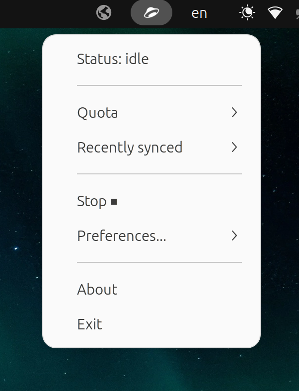

# Yandex Disk indicator and control

YDI provides indicator and control for [yandex-disk](https://yandex.com/support/disk-desktop-linux/) on Linux distributions that conform to freedesktop.org standard. 

## Usage summary

YDI works as an AppIndicator for Yandex Disk activity. The level of control is currently limited to stopping and starting `yandex-disk` daemon.

The icon will change to reflect the current status of the syncronization core. Menu items are self explanatory. 

Clicking Yandex Disk folder path will open your file manager at that path. Nautilus, Thunar and PCManFM are currently supported. 

Preferences allow changing the status update frequency and icon theme.

## Installation details

The recommended method is to install the deb package.

> `yandex-disk` installation is *not* triggered during `dandelion-ydi` package installation. It is implied that yandex-disk is preinstalled and has created `~/.config/yandex-disk folder`. The settings file `ydi.cfg` will be placed there.

Install Yandex Disk first as explained [here](https://yandex.com/support/disk-desktop-linux/installation.html). This one-line installation instruction is taken from that link:

	echo "deb http://repo.yandex.ru/yandex-disk/deb/ stable main" | sudo tee -a /etc/apt/sources.list.d/yandex-disk.list > /dev/null && wget http://repo.yandex.ru/yandex-disk/YANDEX-DISK-KEY.GPG -O- | sudo apt-key add - && sudo apt-get update && sudo apt-get install -y yandex-disk

`dandelion-ydi` Debian package installs itself in /opt/dandelion.systems/ydi. It will put its .desktop file into `~/.local/share/applications` and `~/.config/autostart`.

The installation includes a small shell script `yd_keep_alive.sh`, it is registered in the user's `crontab` to run every hour. `yandex-disk` daemon is prone to stalling in "no internet connection" error state when the computer suspends on power settings. This script checks whether `yandex-disk` daemon is running and restarts it if it is paused on error.

Should you wish to, it is also possible to use YDI Python files directly. Place the contents of this repository into a convenient folder and make `ydi` script executable.

	chmod +x ydi
	./ydi

## Limitations

> `dandelion-ydi` will *not* configure `yandex-disk` daemon for you. You will still have to setup the daemon as Yandex documentation [explains it](https://yandex.com/support/disk-desktop-linux/start.html).

